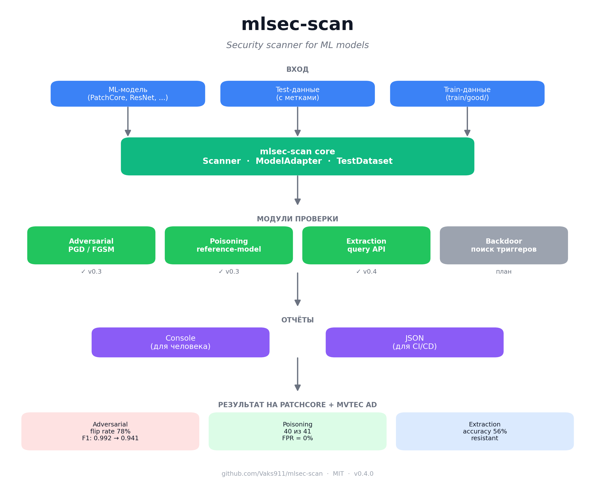
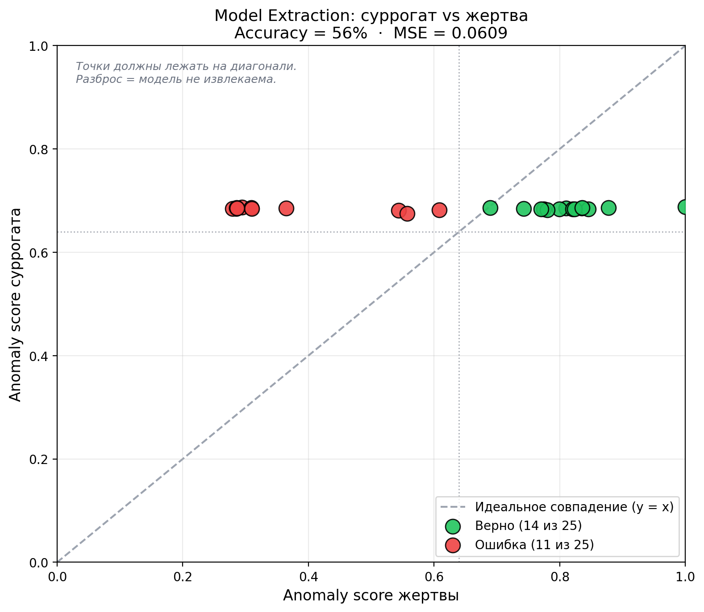
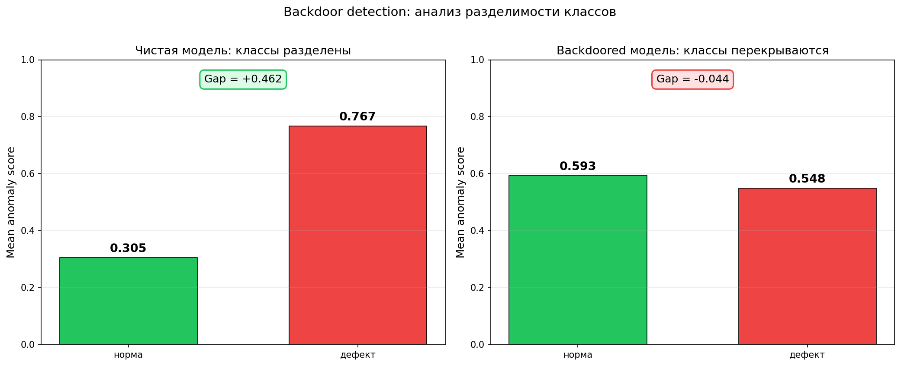

# mlsec-scan



Security scanner for machine learning models.

Проверяет устойчивость ML-модели к четырём классам атак:
- **Adversarial** — FGSM / PGD атаки на входные данные
- **Data Poisoning** — отравление обучающей выборки
- **Model Extraction** — кража модели через API
- **Backdoor Detection** — поиск скрытых триггеров

## Установка

```bash
git clone https://github.com/Vaks911/mlsec-scan.git
cd mlsec-scan
pip install -e .
```

## Быстрый старт

```bash
mlsec-scan scan \
    --model path/to/model.ckpt \
    --model-type patchcore \
    --detector-path path/to/defect-detection \
    --data path/to/test_data \
    --train-data path/to/train/good \
    --modules adversarial,poisoning,extraction,backdoor \
    --format json \
    --output reports/report.json
```

## Команды

| Команда | Что делает |
|---|---|
| `mlsec-scan scan` | Запустить сканирование модели |
| `mlsec-scan list-modules` | Показать доступные модули |
| `mlsec-scan version` | Показать версию |

---

## Модули

### Adversarial

Feature-space PGD: сдвигает фичи дефекта к среднему нормы через дифференцируемый backbone. Атакует только «пограничные» дефекты — те, что модель ловит неуверенно.

**Результат на PatchCore (MVTec AD bottle):**
- flip rate **78%** (7 из 9 пограничных дефектов)
- F1 упал с **0.9920** до **0.9412**

### Poisoning

Reference-model detection: прогоняет каждый файл из `train/good/` через чистую модель. Если anomaly score выше порога — файл подозрительный.

**Результат на MVTec AD bottle:**
- На чистых данных: **0 ложных срабатываний** из 209
- На отравленных (41 подложенный): поймано **40 из 41**, FPR = 0%

### Extraction

Проверяет, можно ли скопировать модель через API.

**Метод:** атакующий делает N запросов к жертве, обучает суррогатную CNN на полученных парах, затем проверяет agreement на hold-out.

**Результат на PatchCore (58 запросов, 25 hold-out):**

| Метрика | Значение |
|---|---:|
| MSE | 0.0579 |
| Accuracy (DEFECT/NORMAL) | **56%** |
| Вердикт | `resistant` |



*Каждая точка — один hold-out пример. Точки не тянутся к диагонали — суррогат не воспроизводит поведение жертвы.*

**Пороги severity:**

| MSE | Accuracy | Severity |
|---|---|---|
| ≤ 0.05 | ≥ 90% | high |
| ≤ 0.10 | ≥ 80% | medium |
| > 0.10 | < 80% | resistant |

### Backdoor Detection

Проверяет модель на наличие скрытого триггера.

**Метод:** анализ разделимости классов. Backdoored-модель обучалась на дефектах с триггером под меткой «норма». Memory bank размылся, и anomaly score нормы и дефектов сблизились.

**Метрика:** `gap = mean_score(defect) − mean_score(normal)`.

| Модель | mean(normal) | mean(defect) | Gap | Вердикт |
|---|---:|---:|---:|---|
| Чистая (v3) | 0.305 | 0.767 | **+0.462** | `resistant` |
| Backdoored | 0.593 | 0.548 | **−0.044** | `vulnerable high` |



*Слева: чистая модель — нормы и дефекты хорошо разделены. Справа: backdoored — gap отрицательный.*

**Ключевое наблюдение:** у заражённой модели gap **отрицательный**. Она считает дефекты более нормальными, чем сами нормы. Это специфичный признак backdoor-атаки.

**Пороги severity:**

| Gap | Severity |
|---|---|
| < 0.15 | high (infected) |
| < 0.25 | medium |
| < 0.35 | low |
| ≥ 0.35 | resistant |

---

## Формат отчёта

### Console (по умолчанию)

```
╭────────────────────────────────────────╮
│ MLSEC-SCAN REPORT                      │
│ Модель:       PatchCore (WideResNet50) │
│ Длительность: 231.27s                  │
│ Критичных:    0                        │
│ High:         1                        │
╰────────────────────────────────────────╯

ADVERSARIAL  vulnerable  (222.72s)
  ● Модель уязвима к adversarial атаке (flip rate 78%)
  Рекомендации:
    → Применить JPEG-препроцессинг перед инференсом
    → Рассмотреть adversarial training
```

### JSON (для CI/CD)

```json
{
  "tool": "mlsec-scan",
  "version": "0.5.0",
  "model": "PatchCore (WideResNet50)",
  "summary": {
    "modules_run": 4,
    "critical": 0,
    "high": 1
  },
  "results": [
    {
      "module": "adversarial",
      "status": "vulnerable",
      "findings": [...],
      "recommendations": [...]
    }
  ]
}
```

---

## Архитектура

```
mlsec_scan/
├── cli.py                    # CLI на click
├── config.py                 # ScanConfig
├── core/
│   ├── model_adapter.py      # Абстрактный интерфейс модели
│   ├── dataset.py            # TestDataset
│   ├── scanner.py            # Оркестратор
│   ├── registry.py           # Реестр модулей
│   └── adapters/
│       └── patchcore.py      # PatchCoreAdapter
├── modules/
│   ├── base.py               # BaseModule
│   ├── adversarial.py        # Adversarial module
│   ├── poisoning.py          # Poisoning module
│   ├── extraction.py         # Extraction module
│   └── backdoor.py           # Backdoor module
├── report/
│   └── json.py               # JSON-генератор
└── utils/
    └── metrics.py            # F1, precision, recall
```

## Как добавить свой модуль

1. Создай файл в `mlsec_scan/modules/`.
2. Наследуйся от `BaseModule`.
3. Зарегистрируй через `@register("my-module")`.
4. Реализуй `run(model, dataset, config)`.
5. Добавь импорт в `modules/__init__.py`.

```python
from mlsec_scan.core.registry import register
from mlsec_scan.modules.base import BaseModule, ModuleResult

@register("my-module")
class MyModule(BaseModule):
    name = "my-module"
    description = "Мой модуль"

    def run(self, model, dataset, config) -> ModuleResult:
        result = ModuleResult(module_name=self.name, status="unknown")
        # ... логика проверки
        return result
```

---

## Статус проекта

- [x] v0.1 — каркас, CLI, модуль Adversarial
- [x] v0.2 — модуль Data Poisoning
- [x] v0.3 — JSON-отчёты
- [x] v0.4 — Model Extraction
- [x] v0.5 — Backdoor Detection
- [ ] v0.6 — HTML-отчёты

## Лицензия

MIT

## Автор

Максим Нагайцев — [GitHub](https://github.com/Vaks911) · [LinkedIn](https://www.linkedin.com/in/maksim-nagaytsev-ab2311432)